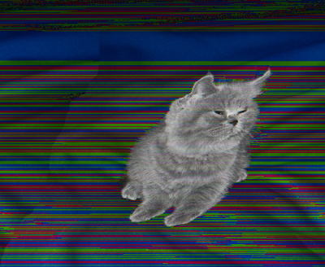

Yo look at this sick picture of a cat

Anyways hello youtube, today I will be teaching you how to access a remote server.
# Step 1: getting the name of your server, and setting a password
Go to [this website](https://sdacs.ucsd.edu/~icc/index.php) and type in your info and it will give you the name of your server.

Click the button with the name of your server and click "change your password". Then use the password reset tool which is kind of a quagmire good luck.
# Step 2: using SSH
ok so what you want to do is hit the windows key + R and this thing will show up

and you should type cmd and hit enter.
Then this thing appears

but instead of Richard it will say your name. Type "ssh [name of your server]@ieng6.ucsd.edu and it should prompt you for a password. You won't be able to see your password as you type it but that's fine. 
